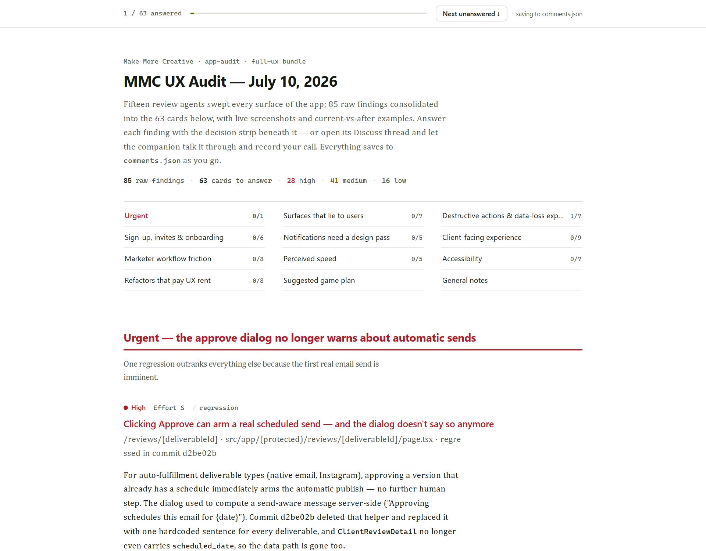
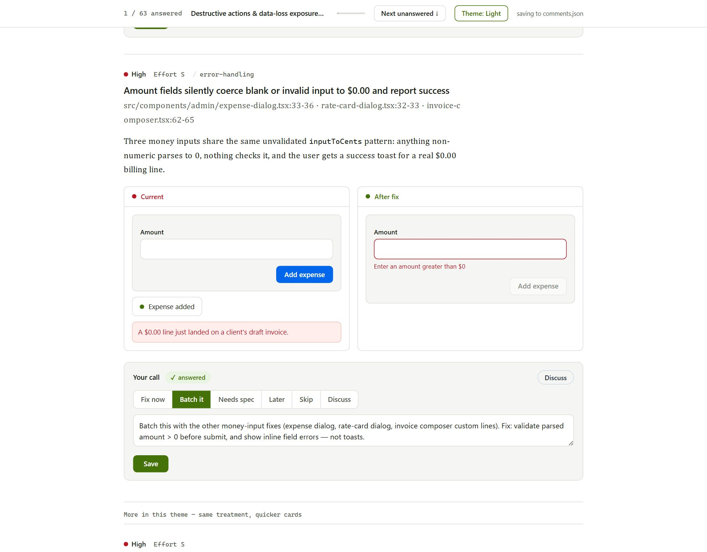

# app-audit — a Claude Code skill

Multi-agent app audits with a **local, annotated report you answer in the browser** — and a
per-finding AI companion that talks each item through with you, updates the report live, and
records your decisions.

Ask Claude to *"run an app audit"* and this skill:

1. **Fans out a panel of review agents** across typed dimensions (UX, security posture,
   performance, code health, a11y, data integrity, error resilience, end-to-end journeys, docs
   drift, test gaps), plus a completeness critic that spawns gap-fill reviewers for anything the
   first wave missed.
2. **Captures live screenshot evidence** from your running app with a standalone headless
   Chromium (never your browser).
3. **Builds a local report** — findings grouped by theme, each anchored to `file:line`, with
   real screenshots, annotated pins, and current-vs-after-fix examples (mocks, flow diagrams,
   code diffs).
4. **Serves it on localhost with an answer layer**: a triage strip (Fix now / Batch it / Needs
   spec / Later / Skip / Discuss) plus a comment box under every finding. Your answers persist
   to `comments.json` on disk, which Claude reads back to build the fix plan — no copy-pasting
   decisions into chat.
5. **Gives every finding a companion chat**: an isolated, repo-aware headless Claude session
   (model selectable per thread) that can discuss the finding, **rewrite the card you're looking
   at** with a live patch, and **save your triage answer for you** once you've talked it through.
   None of it touches your main session's context.

| The report | Answering a finding |
| --- | --- |
|  |  |

## Requirements

- **[Claude Code](https://claude.com/claude-code)** — the skill runs inside it. The `claude` CLI
  must be on your `PATH` for the per-finding companion chats (`claude -p` powers them).
- **Node.js 18+** — the report server, builder, and capture scripts are plain Node (no install step).
- **Playwright Chromium headless shell** *(only for screenshot evidence)* — one-time:
  ```bash
  npx playwright install chromium --only-shell
  ```
  The capture script auto-installs `playwright-core` into a local tools folder on first use and
  finds the browser in Playwright's cache (override with `PLAYWRIGHT_CHROMIUM_EXE`).
- The multi-agent survey uses Claude Code's **Workflow tool** when available; otherwise the skill
  falls back to dispatching finders as parallel subagents.

## Install

**Per project** (recommended — the skill audits the repo it lives in):

```bash
git clone https://github.com/keegandargie/app-audit-skill .claude/skills/app-audit
```

**Global** (available in every project):

```bash
# macOS / Linux
git clone https://github.com/keegandargie/app-audit-skill ~/.claude/skills/app-audit
# Windows
git clone https://github.com/keegandargie/app-audit-skill %USERPROFILE%\.claude\skills\app-audit
```

Then add the run directory to your project's `.gitignore` (reports embed real data and
screenshots):

```gitignore
.reviews/
```

That's it — Claude Code discovers skills automatically.

## Use

In a Claude Code session on the project you want audited:

```
> run an app audit                      # offered the bundles below
> audit the app for UX opportunities    # full-ux bundle
> app audit: security posture + data integrity
> audit billing for data integrity and error resilience
```

**Bundles:** `full-ux` (11-dimension UX sweep) · `pre-launch` (security posture, data integrity,
error resilience, test gaps) · `health` (code health, performance, docs drift) — or any à-la-carte
mix of the ten types in [`references/review-types.md`](references/review-types.md).

When the report is ready, Claude serves it (localhost, port 4610–4640, loopback-only) and hands
you the URL. In the report:

- **Answer each finding** with the triage strip + note, or hit **Discuss** and talk it through
  with the card's companion — say "save that as my answer" and it records your call (decision +
  a distilled note in your voice) itself.
- **Ask the companion to rework a card** ("show the after-fix as a segmented control instead")
  and it patches the card in place; every patch is restorable.
- The progress rail tracks answered count, shows which theme you're in while scrolling, and
  jumps to the next unanswered card. Theme button cycles Auto / Light / Dark.
- Everything persists on disk (`comments.json`, `chats/`, `patches.json`) — close the tab, come
  back later, even in a different Claude session.

When you're done (or partially done), tell Claude to **harvest**: it joins your answers back to
the findings, buckets them (fix-now / batch / spec / later / skip / discuss), surfaces anything
you flagged for discussion, and feeds the buckets into your normal planning flow.

## How it's put together

```
SKILL.md                     the skill definition Claude follows
references/
  review-types.md            the type/dimension library (edit to fit your domain)
  report-markup.md           the report's markup contract (cards, mocks, flows, pins)
  DESIGN.md                  the report's own design identity (tokens, roles, rules)
scripts/
  workflow.js                multi-agent survey: parallel finders → critic → gap-fill
  capture.mjs                spec-driven headless screenshot capture
  build-report.mjs           template + content + screenshots → report.html
  serve-report.mjs           local server: static report + comments API + companion broker
assets/
  report-template.html       the report shell: styles, triage widgets, chat UI, theming
```

Design notes: the report has its own visual identity (documented in
[`references/DESIGN.md`](references/DESIGN.md)) so it never inherits the audited app's look —
**except** inside mock UI that depicts your app, which follows *your* design system
(`meta.json → "app": { "accent": "#…" }`). Companion agents are instructed to read both
references before editing cards, so agent-authored content stays on-system.

## Privacy & safety

- **Local only.** The server binds `127.0.0.1`; findings, screenshots, and answers never leave
  your machine. The skill explicitly forbids publishing audit content to hosted artifacts.
- **Read-only audit.** Finder agents never edit files, run migrations, or start servers.
  Companion chats get read-only repo tools; card patches are HTML-sanitized (no scripts/styles)
  and restorable.
- Security-boundary findings are routed to your project's security review process, not hot-fixed.

## License

MIT — see [LICENSE](LICENSE).
